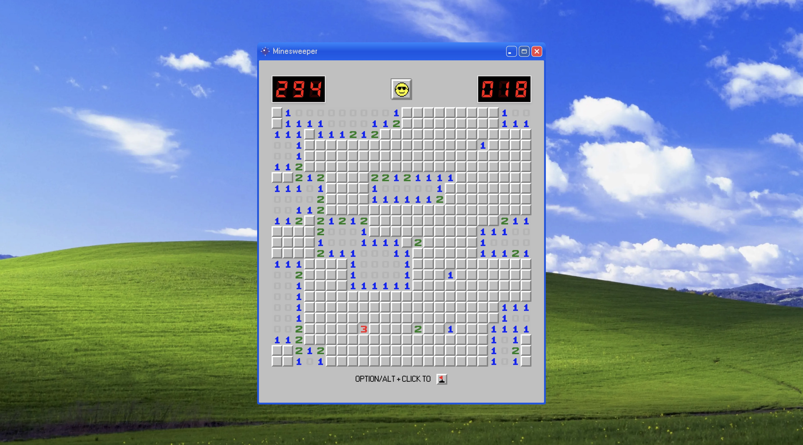
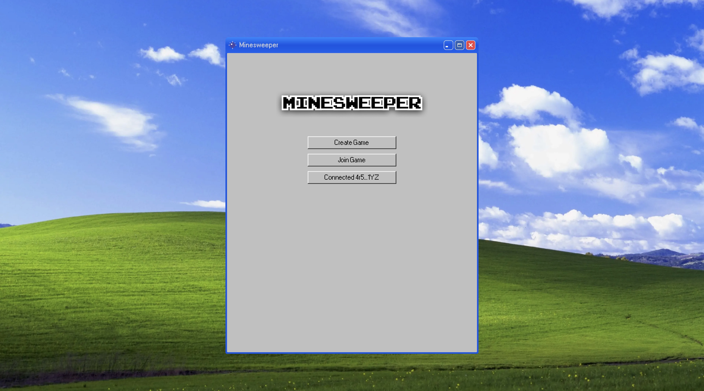
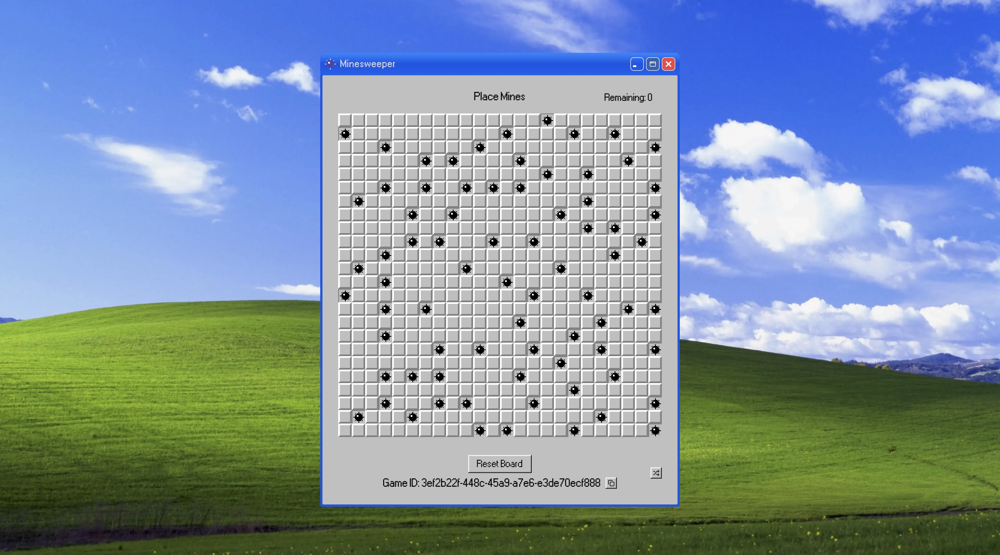
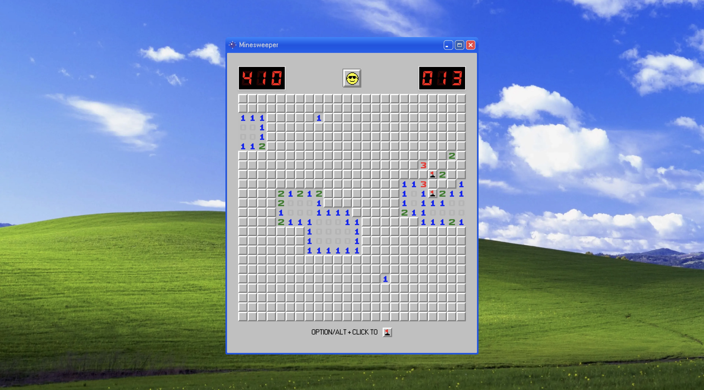
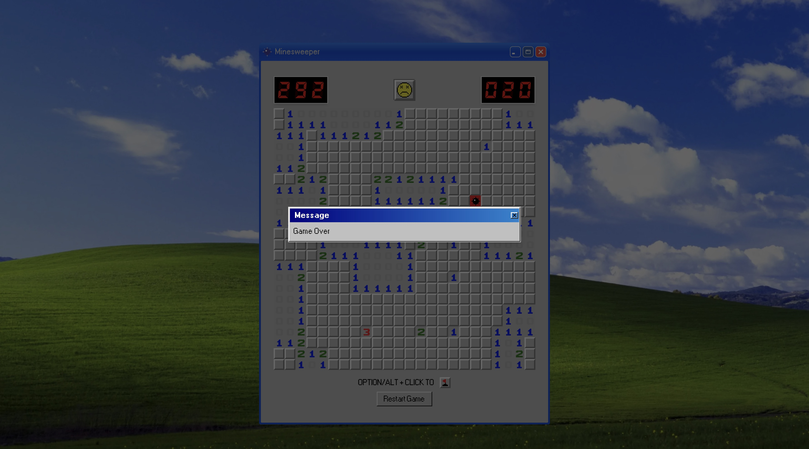

<p style="display: flex; justify-content: center;">
</p>

This is a simple implementation of the classic game Minesweeper using Nillion Blind Computation.

The Game is played in a 2D grid where the player must reveal all the cells that do not contain a mine. The player can reveal a cell by clicking on it. If the cell contains a mine, the game is over. If the cell does not contain a mine, the cell will reveal a number that indicates the number of mines in the neighboring cells. The player can also flag a cell by `⌥ + CLICK` on it. The player wins the game when all the cells that do not contain a mine are revealed.

The Board is a `24*24` grid with `75 mines`.



## How to play 🎮

Before starting the game, make sure you have Metamask Flask installed and Nillion Snap Installed. First you need to start a local devnet. (more in the [Get Started](#get-started-) section)

1. Connect you Nillion Key using the `Connect with Nillion` button.
2. Create a new game by clicking the `Create Game` button.
3. In this step you have to place 75 mines in the board. You can do this by clicking on the cells. You can also randomize the mines by clicking the `Shuffle` button on the bottom-right corner.
4. Once Mines are placed, click the `Create Game` button, this will store the game and give you a game id. Copy this id.
5. Go to home page and click the `Join Game` button. Paste the game id and click `Join Game`.
6. Now you can start playing the game. Reveal the cells by clicking on them and flag the cells by `⌥ + CLICK` on them.

## Screenshots 📸

<table>
  <tr>
    <td valign="top" width="50%">
      <br>
      
    </td>
    <td valign="top" width="50%">
      <br>
      
    </td>
  </tr>
</table>

<table>
  <tr>
    <td valign="top" width="50%">
      <br>
            
    </td>
    <td valign="top" width="50%">
      <br>
            
    </td>
  </tr>
</table>

## Demo Video 🎥

## How it works 🛠️

The game is implemented using Nillion Blind Computation. The game is divided into two parts, the frontend and the nada programs.

The frontend is inspired by the classic Minesweeper game from Windows XP. It uses `98.css` for the Windows XP look and feel. The game is implemented using Next.js and Tailwind CSS.

The nada programs has two parties:

1. `Party1`: The party who places mines.
2. `Party2`: The party who minesweeps.

The program takes total of 152 inputs, divided into two parts:

1. **Mine Locations**: Total of 75 mines divided as `x,y` values so total of 150 values.
2. **User Move**: The user move location as `location-0` and `location-1` as `x,y` value.

The main logic of Minesweeper game is to check the number adjacent mines and do the following:

1. If the cell has a mine, the game is over.
2. If the cell has no mine, reveal the cell and check the number of mines in the neighboring cells.
3. If the cell has no mine and no neighboring mines, reveal all the neighboring cells.
4. If the cell has no mine and has neighboring mines, reveal the cell and show the number of neighboring mines.

The nada program calculates the number of adjacent mines on the grid to that location and also checks if the location has a mine.

The program returns two outputs:

1. `adjacent_mines`: The number of mines in the neighboring cells.
2. `game_over`: If the cell has a mine, the game is over.

Here is the Basic Logic for the nada program:

```py
def is_mine(
    mine_locations: list[list[SecretInteger]],
    row: SecretInteger, col: SecretInteger
) -> SecretInteger:
    result = Integer(-1)
    for mine in mine_locations:
        actual = (mine[0] * Integer(100) + mine[1])
        given = (row * Integer(100) + col)
        result = result * (actual - given)

    res = is_equal(result, Integer(0))
    return res


def count_adjacent_mines(
    mine_locations: list[list[SecretInteger]],
    row: SecretInteger,
    col: SecretInteger
) -> SecretInteger:
    count = Integer(1)
    for i in range(8):
        newRow = row + dx[i]
        newCol = col + dy[i]
        valid = is_valid(newRow, newCol)
        mine = is_mine(mine_locations, newRow, newCol)
        count = count + (Integer(1) * valid * mine)

    return count


def make_move(
    mine_locations: list[list[SecretInteger]],
    row: SecretInteger,
    col: SecretInteger
) -> list[Output]:
    outputs: list[Output] = []
    count = count_adjacent_mines(mine_locations, row, col)
    game_over = is_mine(mine_locations, row, col)

    outputs.append(Output(count, "adjacent_mines", Party("Party1")))
    outputs.append(Output(game_over, "game_over", Party("Party1")))

    return outputs
```

<details>
<summary>Full Code</summary>

```py
from nada_dsl import *

BOARD_SIZE = 24
NUM_MINES = 75

valid = Integer(1)
invalid = Integer(0)

dx = [Integer(-1), Integer(-1), Integer(-1), Integer(0),
      Integer(0), Integer(1), Integer(1), Integer(1)]
dy = [Integer(-1), Integer(0), Integer(1), Integer(-1),
      Integer(1), Integer(-1), Integer(0), Integer(1)]


def is_equal(a: SecretInteger, b: SecretInteger) -> SecretInteger:
    return (a > b).if_else(invalid, (a < b).if_else(invalid, valid))


def is_mine(
    mine_locations: list[list[SecretInteger]],
    row: SecretInteger, col: SecretInteger
) -> SecretInteger:
    result = Integer(-1)
    for mine in mine_locations:
        actual = (mine[0] * Integer(100) + mine[1])
        given = (row * Integer(100) + col)
        result = result * (actual - given)

    res = is_equal(result, Integer(0))
    return res


def is_valid(row: SecretInteger, col: SecretInteger) -> SecretInteger:
    valid_row_max = row <= Integer(BOARD_SIZE)
    valid_row_min = row > Integer(0)
    valid_col_max = col <= Integer(BOARD_SIZE)
    valid_col_min = col > Integer(0)

    cmp_row_max = valid_row_max.if_else(valid, invalid)
    cmp_row_min = valid_row_min.if_else(valid, invalid)
    cmp_col_max = valid_col_max.if_else(valid, invalid)
    cmp_col_min = valid_col_min.if_else(valid, invalid)

    res = cmp_row_max * cmp_row_min * cmp_col_max * cmp_col_min
    return res


def count_adjacent_mines(
    mine_locations: list[list[SecretInteger]],
    row: SecretInteger,
    col: SecretInteger
) -> SecretInteger:
    count = Integer(1)
    for i in range(8):
        newRow = row + dx[i]
        newCol = col + dy[i]
        valid = is_valid(newRow, newCol)
        mine = is_mine(mine_locations, newRow, newCol)
        count = count + (Integer(1) * valid * mine)

    return count


def make_move(
    mine_locations: list[list[SecretInteger]],
    row: SecretInteger,
    col: SecretInteger
) -> list[Output]:
    outputs: list[Output] = []
    count = count_adjacent_mines(mine_locations, row, col)
    game_over = is_mine(mine_locations, row, col)

    outputs.append(Output(count, "adjacent_mines", Party("Party1")))
    outputs.append(Output(game_over, "game_over", Party("Party1")))

    return outputs


def nada_main():
    party1 = Party(name="Party1")
    party2 = Party(name="Party2")

    mine_locations: list[list[SecretInteger]] = []
    location: list[SecretInteger] = []

    # Take Mine Locations from Party 1
    for i in range(NUM_MINES):
        mine_locations.append([])
        mine_locations[i].append(SecretInteger(
            Input(name="mine-x-" + str(i), party=party1)))
        mine_locations[i].append(SecretInteger(
            Input(name="mine-y-" + str(i), party=party1)))

    # Take Input Location from Party 2
    for i in range(2):
        location.append(SecretInteger(
            Input(name=f"location-{i}", party=party2)))

    outputs: list[Output] = make_move(
        mine_locations, row=location[0], col=location[1])

    return outputs

```

</details>

## 🧑🏼‍💻 Tech Stack

- **Frontend**: Next.js, Tailwind CSS, shadcn
- **Integration**: wagmi, viem, nillion-sdk
- **Programs**: nada-dsl

## Get Started 🚀

The following repository is a turborepo and divided into the following:

- `apps/www` - The web application for the game.
- `packages/programs` - The nillion programs for computation.

First install the dependencies by running the following:

```bash
pnpm install
```

Next, start the local devnet by going in the `packages/programs` directory and running the following command:

```bash
pnpm create-venv && pnpm start-devnet
```

This will start a local devnet for the Nillion SDK. Once the devnet is started, you can go to the `apps/www` directory and run the following:

```bash
pnpm dev
```

> Make sure you have required environment variables in the `.env` file.

This will start the web application on `http://localhost:3000`.
